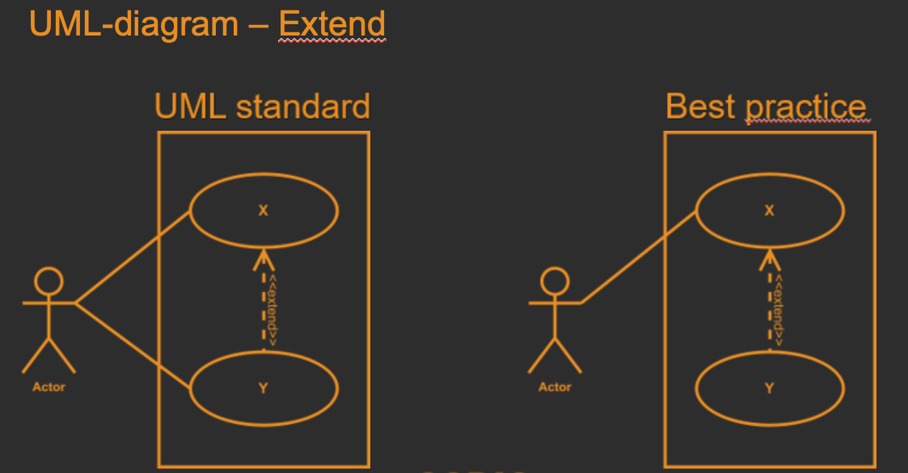
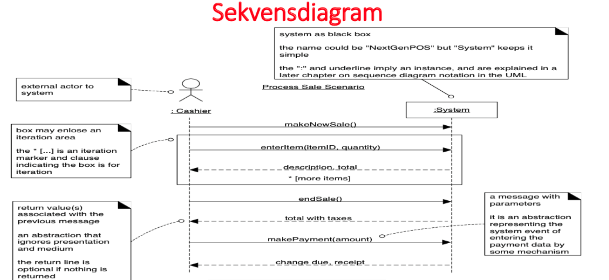

# Objektorienterad analys, design och programmering.

## Teori

Man använder Objektorienterad analys och design (OOAD) som metod för att modellera ett system som består av en grupp av samverkande objekt där varje objekt representerar några klasser. Objektet kännetecknas av sin klass, sitt tillstånd och sitt beteende. Samverkan mellan objekt sker genom att de skickar meddelanden till varandra. 

Den objektorienterad analys (OOA) -processen används för att analysera funktionella krav för att kunna utveckla en konceptuell modell som består av olika diagram. Denna modell beskriver systemet för att tillfredsställa kundens behov. Detta krav kan delas i flera deluppgifter under analysfasen, där varje uppgift ska analyseras separat.

## Livscykel
---

System Development Life Cycle (SDLC)

SDLC är en metodik/process för att underlätta utveckling som är planstyrd och förändringsdriven.
Systemet hjälper projektledaren med den så kallade projekttriangeln

- Tid
- Krav
- Budget


### Faser i en livscykel

1. Konceptuell planering

I den första fasen går man igenom omfattningen av hela projektet. En diskusion påbörjas mellan seniora utvecklare, projektledare, kund, och representant för slutanvändare.
Man kan dela upp det i olika punkter:

- Begränsningar
    - Resurser
    - Budget
    - Tid

- Utvärdering
    - Hur ska projektet utvärderas?

- Riskanalys
    - Vilka risker finns?

- Befintlig teknik
    - Vad finns idag?
    - Investeringsbehov?

2. Kravställning(analys)

I den andra fasen, kravställning, bryts den konceptuella planeringen ned i mindre delar.

Krav identifieras och utvärderas. Dessa sammanställs och presenteras i möte med representant för slutanvändare som får verifiera och godkänna kraven. Vi ska helt enkelt tolka beställarens krav, och hitta sätt att verifiera att vi är på samma våglängd.

Vi fastställer krav i ett Software Requirements Specification(SRS) som beskriver vad systemet ska göra och det förväntas fungera.

SRS kan brytas ned i 4 D:
    - Define your products purpose
    - Describe what you are building
    - Detail the requirements
    - Deliver it for approval

DEFINE, DESCRIBE, DETAIL, DELIVER.

3. Design

I denna fas används SRS som referens. Målet med detta steg är att få med sig en Design Document Specification(DDS).

DDS är ett detaljerat dokument som listar samtliga punkter i kontext av en produkt eller en process. Den beskriver hur punkterna i SRS kommer att bli implementerade.
Som exempel kan här specificeras hur användare ska interagera med systemet.

En samling med krav används alltså för att beskriva en önskvärd lösning. För att vi ska kunna nå detta stadie är det viktigt att kravställningen är tydlig.

Designkrav brukar innehålla en överblick av projektet, huvudmål, och vilken som målgruppen.

Vidare så innehåller den även funktionella krav, vilket vi kommer att gå in på i mer detalj senare, estetiska aspekter, icke-funktionella krav, samt rekommendationer och begränsningar.

Designkrav är mer skrivna för utvecklarna, än övriga stackholders så som beställare.

4. Utveckling och Testing

För i tiden brukade detta vara uppdelat i 2 faser där man skrev tester efter att utveckling-fasen var färdig.

Idag, med moderna system, är det brukligt att interage testning med utveckling genom Test-driven Development(TDD)

Vi börjar med att skriva våra tester och skriver kod så att det testerna godkännas.

5. Driftsättning

Även kallar lansering/release. Detta kan göras i flera steg, bland annat med beta-test där utvalda användare ger feedback.

6. Drift och underhåll

Detta steg sker efter driftsättning där vi utvärder befintliga funktioner, analyserar nya funktioner, fixar buggar...

Har det skett några missförstång i planeringen? Är kund och utvecklare överens om att produkten är vad den var tänkt att vara?

7. Utvärdering

Vi går här igenom och utvärderar pågående arbete. 

- Vad går bra / mindre bra? 
    - Vad kan göras?
        - Utbildning
        - Förbättringar
        - Processer

8. Avfallshantering

Här hittar och identifierar vi material som är överflödiga, eller som måste uppdateras.


## Krav
---

Med krav menas dokumenterat behov. Design, produkt eller process ska uppfylla kravet.
Krav används ofta inom produktutveckling och optimeraring av processer.

*Funktionalitet som en produkt eller tjänst måste ha för att produkten eller tjänsten ska vara användbar för intressenten*

- Önskvärd egenskap eller funktion hos ett IT-system
- Beskrivningar av systemets tjänster och begränsningar
- Vad slutprodukten ska utföra, samt hur den ska se ut

Om vi tar ett kundhanteringssystem som exempel så kan vi (bland många andra) hitta följande krav:

- Man ska kunna lägga till nya kunder
- Användare ska kunna uppdatera betalningsmetod

###### Punktlista Krav

- Krav ska vara tydliga och begripliga
- Krav ska vara testbara
- Krav kan ändras
- Krav ska vara kompletta och korrekta
- Krav ska vara genomförbara
- Krav ska ha ett värde för användaren
- Krav är en referenspunkt för testning
- Krav != Kod
- Beställare != Användare
- Prioritet
    - Ska = Hög prioritet
    - Borde = LÄgra prioritet


##### FURPS

- Functional
- Usability
- Reliability
- Performance
- Supportability


**Funktionella(Functional)**

Krav på hur systemet ska fungera.

Här specificerar vi allt ifrån vad en viss parameter ska ge för resultat, till vad systemet INTE ska göra.

*Man ska kunna lägga till/redigera/ta bort ort*
*Man ska kunna lägga till/redigare/ta bort användare*

**Icke-Funktionella**

Beskriver hur systemet ska fungera.

Komplement till funktionella krav.

Beskriver systemets prestanda och hur systemet ska bete sig.

- Användarvänlighet
    - Hur snabbt kan en användare lära sig systemet?
- Kapacitet
    - Hur många användare kan systemet klara av att hantera på en och samma gång?
- Säkerhet
    - Mått på hur väl systemet klarar av yttre intrångsförsök
- Underhållbarhet
    - Mått på hur enkelt det är att underhålla systemet
- Tillgänglighet
    - Ett krav som beskriver systemet tillgänglighet, exempelvis uppe och tillgänglig 99.99% av tiden


**Användarbarhet(Usability)**

Beskriver hur användarvänligt system är i förhållande till att lära sig det, använda det, och att få hjälp vid behov.

Exempel:

- Inlärningstid ska inte vara längre än 2 timmar
- Det ska vara tydligt för användaren hur en handling ska utföra
- Tydliga beskrivningar i exempelvis inmatningsfält.


**Pålitlighet(Reliability)**

Att kunna lita på systemet under användning.

Vi kan här lista felfrekvens där hur ofta fel får förekomma specificeras.

*Fel av allvarlighetsgrad medel får inträffa max 3 gånger per år*

*Vid fel ska systemet kunna återställa data till ursprungligt skick*


**Prestanda(Performance)**

Tid för systemet att svara på en förfrågan.

*När 300 användare samtidigt söker och registrerar ärenden får svarstiderna inte överstiga 5 sekunder*


**Support(Supportability)**

Krav som rör underhåll och förvaltning i syfte att underlätta testning och felsökning.

*Det ska finnas drift-och systemdokumentation*
*Kommentarer ska finnas i koden*


## User Stories
---

User Stories är korta, och står för en simpel beskrivning, från en användares perspektiv.
User Stories är viktiga då de hjälper att minska gapet mellan utvecklare och kund och förser ett okomplicerat språk mellan anvöndare och det tekniska teamet.

User Stories fokuserar på va användaren behöver, inte på vad systemet ska leverera och lämnar utrymme för vidare diskusion kring lösningar.

Man kan kalla det för en förenklad beskrivning av ett krav.

*Som kund vill jag få ett sms när mitt paket är levererat till postombud så att jag kan hämta ut det*

Dessa kan skrivas av vem som helst, men *vem som helst* är ofta någon typ av stakeholder, någon som är intressent i projektet; beställare, användare, projektledare, utvecklare...

```
As a <role> I want to <action> <object> so that <business value>
```

```
Som <roll> vill jag <händelse>, för att <nytta>
```

Det finns 3 viktiga element i en user story: VVV

- Vem
- Vad
- Varför

###### User Stories - Exempel

- Som [roll] vill jag [mål/önskan/händelse]
    - som utbildare vill jag se när det finns lediga salar
    - som mobilanvändare vill jag se en responsiv version av hemsidan

- Som [roll] vill jag [mål/önskan/händelse], för att [nytta/syfte]
    - som utbildare vill jag se när det finns lediga salar, för att direkt kunna boka
    - som mobilanvändare vill jag se en responsiv version av hemsidan, för att den ska ladda snabbare och vara anpassad att använda på en mobil

###### Acceptanskriterier

Innan en user story implementeras ska acceptanskriterier skrivas för att se till så att målen uppfylls.

Kriterier som ska uppfyllas för att produktägaren ska acceptera och klarmarkera en user stor.

De behöver tydligt defineras med i en lista med tydliga scenarier och hjälper för att avgränsa uppdraget, beskriva vad som ska uppnås, underlätta planering och användas som grund för testning.

###### Acceptanskriterier - Exempel

**User Story**

Som besökare vill jag kunna se de senaste tweetsen från företaget direkt på startsidan.

**Acceptanskriterier**

- Webbplatsens startsida visar de tre senaste tweetsen
- Tweetsen visas inom 15 minuter från att de tweetades
- Om en tweet raderas ska den inte visas på startsidan
- Länkar i tweetsen ska fungera
- Retweets ska visas


## Kravhantering
---

*Ett systematiskt tillvägagångsätt för att hitta, dokumentera, organisera och spåra systemets förändrade krav*

Kravhantering är en central del inom utveckling. Målet är att undvika ökade kostnader och misslyckade projekt.

Här fastsställs intressenters produkmål och specifikationerna av dessa.

intressent -> Behov -> Mål -> Krav -> IT-system

###### Faktorer som påverkar realisering

- Tid
- Budget
- Personella resurser
- Teknisk svårighet
- Kravmängd

###### Kravhanteringsprocessen

Insamling
    - Identifiera och samla in krav
Analys
    - Säkerställa att kraven är tydliga, korrekta, nödvändiga, spårbara etc
Validering
    - Säkerställa att kraven har ett värde för projektet
Prioritering
    - Prioritering av kraven för utveckling
Förvaltning
    - Hantera ändringar

###### Kravspecifikation

Klar och tydlig formulering av beställarens krav.
    - funktioner
    - egenskaper
    - begränsningar
    - system för samverkan
    - språk

Kravspecifikation ligger som grund för:
- utveckling av systemet
- testspecifikation
- användardokumentation
- underhållsdokumentation

## Kravinsamling
---

Här samlar vi in alla krav från intressenter och representativa för verksamheten.

Vi definera 
- syfte
- mål
- användare
- avgränsningar

Detta steg resulterar i en kravspecifikation.

Målet med kravinsamlingen är att ta reda på vad användarna vill ha, vilka uppgifter de behöver utföra, vilka problem de har och vad som kan förbättras.
Vi försöker se det hela från användarens synvinkel.

Svårigheterna ligger oftast i att användaren inte vet vad den vill ha eller kan uttrycka va slutanvändaren behöver.
Ofta är det först när användaren ser lösningen som lampan tänds. 

Målen kan ändras längs vägen och kraven kan vara otydliga eller otillräckliga.

###### Komma igång med kravinsamling

- Identifiera intressenter
- Analysera existerande system/verksamhet
- Prata med användarna
- Se över omgivningen
- Problembeskrivning
- Definera krav på olika nivåer
- Dokumentera
- Håll kunden delaktig

###### Kravinsamling - Olika tekniker

*Valet av arbetssätt för kravinsamlingen beror på olika faktorer så som tid, resurser, vilken information som behöver identifieras, samt vilken metod som systemutvecklingen kommer att följa*

- Intervju
- Enkät
- Brainstorming
- Workshop
- Användarfall
- Analys av företagsdokument
- Observation


###### Viktiga definitioner

**Systemkrav**

Systemkrav är en mer detaljerad version av användarkraven och ska spegla hela systemet. Denna ligger till grund för hur implementationen kommer att se ut.

**Modell**

En modell är en väldefinerad och förenklad beskrivning av en process.
Ger en abstrakt vy av processen, ur en särskild synvinkel.


**Process**

En mängd aktiviteter som resulterar i en färdig produkt som både inkluderar utvecklingen och resultatet, och bestämmer i vilken ordning som stegen inom utvecklingen ska tas.

**Metod**

Detaljerad beskrivning av tillvägagångsätt för att lösa ett problem.
Strukturerat sätt att utföra utveckling, hur något ska göras.

Detta innefattar:
- Arbetssätt: Hur man gör
- Notation: Hur man beskriver det man gör
- Begrepp: Hur man säkerställer att alla talar om samma saker

**Produkt**

- Slutprodukt
- En komponent i ett system
- Färdiga system
- En prototyp
- Ett dokument i ett steg i processen

**Kund/Beställare**

Den som beställer ett system


**Användare**

Den som ska använda slutprodukten

Kund kan vara användare, men så är inte alltid fallet.

**Feasability study**

Görs oftast av en senior utvecklare i syfte att ta reda på om projektet är genomförbart.

###### Roller i ett projekt

```
Roll                        Ansvar
Kravanalytiker              Samla in, dokumentera och strukturera alla krav
Chef, jurist, helpdesk      Bistå med expertkompetens inom sitt område
Projektledare               Ansvar för att systemets krav är korrekta
Användare                   Kommer med idéer och förbättringsförslag
Beställare                  Ansvarig för att kravspec är korrekt
Leverantör                  Tolkar kraven och kommer med lösningar
Styrgrupp                   Fattar beslut som rör t.ex pengar, tid, planering
```

## Kravprioritering

Det går inte alltid att uppfylla alla krav. Vi har tid, budget och motsägande krav att ta ställning till.

Vi behöver prioritera våra krav.

Kraven kategoriseras initialt efter "vikt".

1. Oflexibla / "måsten"
    - Säkerhet
    - Lagliga aspekter
2. Affärsregler
    - Demo vid världsutsällning om 18 månader
        - Produkten ska säljas till flera olika länder
            - språk
            - valuta
3. Övrigt

**Vad?**

Process för att identifiera krav baserat på dess värde för intressenter

**Varför?**

Hitta de mest betydelsefulla kraven
Vad måste/bör finnas med i första versionen?
    - vi implementerar krav som inte är av lika stor vikt i senare versioner.

**Vad baseras det på?**

- Mest värde för pengarna
- Riskanalys

###### Prioriteringstekniker - Riskanalys

**Process**

En systematisk kartläggning där vi identifierar risker och försöker förutsätta hur de påverkar
 - projektet
 - verksamheten
 - informationstillgångar
 - resurser

Vad är då en risk?

En risk är något som kan gå fel där vi bedömmer efter två huvudparametrar:

Sannolikhet - hur sannolikt är det att risken förverkligas?

Konsekvens - vad blir effekten om risken förverkligas?

###### Exempel på risker

- Projektets budget håller inte
- Bristande användbarhet
- För långa svarstider

Processen består av följande steg:

1. Identifiera risker

2. Identifiering av konsekvens

3. Bedömning av sannolikhet för varje risk

4. Bedömning av konsekvensen

5. Åtgärdsförslag

###### Värdeskalor

Gå nu igenom samtliga krav och tilldela varje krav ett värde, ju högre värde, ju högre prioritet.

**MoSCoW**

En prioriteringsteknik som ofta används inom programutveckling

- Must = Krav som måste finnas med i leveransen
- Should - Krav som är nödvändiga och högt prioriterade. Bör ingå.
- Could - Önskvärt, ej nödvändigt. Realiseras om tid/budget håller.
- Won't - Behöver inte realiseras. Kan tillkomma i senare version.

## Användningsfall - Use Cases

Här dokumenteras krav. Primärt handlar det om att dokumentera funktionella krav, alltså krav på hur systemet ska fungera.

Användningsfall beskriver vad systemet ska göra, och inte hur, och är en generell beskrivning, vi går alltså inte igenom någon designlösning i detta steget.

Berättar en historia, om hur ett mål kan uppfyllas.

- Utförs under en begränsad tid

- Det finns en start, och minst ett slut. Målet nås inom en rimlig.

Användningsfall...

- beskriver en sekvens av interaktioner
    - aktör
    - system

- beskriver en funktion som är synlig för aktören
    - hela vägen
    - ur aktörens perspektiv
    - värde för aktören
        - namnet uttrycker det värde det ger aktören

- kan bestå av flera delfall
    - till exempel "Logga in"
        - innehåller flera steg
        - kan ingå i ett större användningsfall

###### Exempel på användningsfall

Exempel på användnings är till exempel att...

- använda en automat
    - Ta ut pengar
    - Överföra pengar
    - Kontrollera saldo

- skapa användarkonto
    - Logga in

- ändra betalningsmetod

- köra bil
    - parkera
    - bromsa

###### Aktör

Vi sa att användningsfall beskriver en sekvens av interaktioner där vi har en aktör och ett system.

Vem är då aktören?

Aktören är en roll, som inte nödvändigtvis måste vara en människa. Det är inte heller en enskild individ eller användare. Utan det handlar mer om en general typ av användare som interagerar med systemet.
Aktörens beskrivs väldigt kortfattat utifrån sina egenskaper. I ett UML-diagram visualiserar aktören som en streckfigur.

Det finns två typer av aktörer; Primär och Sekundär.

Den primära aktören har ett mål med interaktionen och initierar interaktionen.

Exempel: 

Kund som ska ta ut pengar.

Den sekundära aktören har inget mål med interaktionen. Den svarar på den primära aktörens interaktioner, och finns med för att den ska kunna uppnå målet.

Exempel:

Personal som fyller på bankomat med pengar.


###### Händelseförlopp

Händelseförloppet beskrivs först i ett separat textdokument vilket specificerar utförandet av ett användingsfall.

- vad systemet gör
- hur systemet interagerar med aktörer


###### Identifiera användningsfall och olika typer av användingsfall

Vi börjar med att försöka hitta aktörer, för att därefter se vilka funktioner, interaktioner och externa händelser som finns i positionen.

"Codic Entertainment har en medlemsportal där kunder behöver anmäla sig för att ta del av samtliga tjänster. Kontot måste skapas av en systemadministratör."

**Informellt användningsfall**


**Formellt användningsfall**


**Diagram**

UML 





## UML

Systemutvecklare använder olika typer av modellspråk, där det mest använda är UML(Unified Modeling Langugage).

Olika diagram skapas med hjälp av UML för att visa systemets statiska struktur, samt dess dynamiska beteende.

UML Modeller används för att beskriva en verklighet eller ett system utifrån en eller flera synvinklar.
Varje sådan synvinkel har ett begränsat antal saker som man vill visa och fokusera på. 

Med modell menar vi i denna kontext en förenklad beskrivning av något.

Modeller används för att beskriva en verklighet eller ett system utifrån en eller flera synvinklar. Varje sådan synvinkel har ett begränsat antal saker som man vill visa och fokusera på.

Det finns 13 olika diagramtyper i UML 2.0:

**Structural Diagrams**

- Class Diagram
- Object Diagram
- Component Diagram
- Composite Structure Diagram
- Deployment Diagram
- Package Diagram

**Behavioral Diagrams**

- Activity Diagram
- Use Case Diagram
- State Machine Diagram

**Interaction Diagrams**

- Sequence Diagram
- Communication Diagram
- Interaction Overview Diagram
- Timing Diagram


## Objektorienterad Design

Designen minskar gapet mellan kraven och den faktiska implementationen.

Det är konceptuell lösning som uppfyller kraven.

Analysen berättar vad som krävs, och designen berättar hur systemet ska bli konstruerat.

Målet med analysen var att förstå, och för detta utförde vi vår Kravhanteringsprocess.

I design-fasen så utgår vi ifrån analysmodellerna och dokument.

Målet med designen är således att definiera, organisera och strukturera komponenter av lösningen som en mall för implementationen.

###### Analysmodeller VS Designmodeller

I analysfasen skapar vi bland annat klassdiagram och användningsfalldiagram.

Här, i designfasen, tar vi dessa diagram som input för att generera designmodeller, bland annat design class diagram.

 

Syftet med designen är att få en djupare förståelde för icke-funktionella krav, samt dela upp den kommande implementationen i mindre delar.
Designfasen innefattar:

- Hitta viktiga gränssnitt i systemet
- Skapa en struktur på hur systemets stora delar fungerar ihop och bryta ned dessa i delar så att varje del kan struktureras mer i detalj.

Vi försöker först besvara frågan om vilka objekt som ska finnas med i systemet för att därefter kolla efter beteenden.

Design är att skapa sig en bild av:
- Vilka objekt, klasser och metoder
- hur koden ska konstrueras
- designmodellen

Design - en beskrivning av den rekommenderade lösningen konverteras till logiska och fysiska system specifikationer.


Logical design – all functionalfeatures of the system chosen for development in analysis are described independently of anycomputer platform. 
Physical design –the logical specifications of the system from logical design are transformed into the technology-specific details from which all programming and system construction can be accomplished.

Indata till designen är alltstå kravspecifikationen som den uttryckts i de modeller som skapades under analysfasen.

###### Modeller i designfasen

**Domänmodeller**

Illustrerar koncept ur problemdomänen. Klassern i domänmodellen tilldelas vanligtvis inga metoder.

```
Sale
---
Date
Time
```


Använd följande steg för att konstruera en domänmodell:

1. Lista(identifiera) kandidater
2. Rita ut klasserna i en domänmodell
3. Lägg till associationer
4. Lägg till attribut

**Konceptuellt klassdiagram**


**UML Klassdiagram**


**Sekvensdiagram**

- Ett sekvensdiagram visar hur sekvensen av anrop kan ske.

- Visar hur objekt samarbetar för att lösa en uppgift.

- Visar detaljerat i vilken tidsordning objekt interagerar

- beskriver systemets beteende

- identifierar saknade klasser

- metodern visas i tidsordning

- varje användningsfall får ett sekvensdiagram som illustrerar hur de olika komponenterna i systemet ska uppnå de funktionella kraven




Länkar:

SRS

https://krazytech.com/projects/sample-software-requirements-specificationsrs-report-airline-database

https://searchsoftwarequality.techtarget.com/definition/software-requirements-specification

DDS

http://cci.drexel.edu/seniordesign/2016_2017/HighWater/HighWaterDesignDocument.pdf

https://northell.design/blog/how-to-write-the-design-specifications-quick-guide/

User Stories

https://www.researchgate.net/publication/261147363_User_stories_template_for_object-oriented_applications

Use Cases

https://www.usability.gov/how-to-and-tools/methods/use-cases.html

https://www.lucidchart.com/pages/uml-use-case-diagram

Objectorienterad Design

https://www.oodesign.com

OOAD
https://www.youtube.com/watch?v=bnbwNe-w2U4&list=PL6XklZATqYx9dj72MKG6wLYjljeB2odra&index=7&ab_channel=BrianGreen

https://www.tutorialspoint.com/object_oriented_analysis_design/ooad_object_oriented_design.htm


